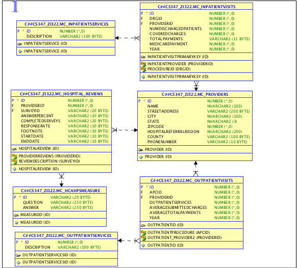
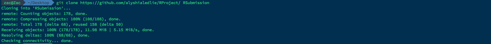

Medicare Analysis
===

In 2011, the health care industry consumed 17.7% of US GDP, an average of 8,508 per person in the US. This is the highest as both a dollar ammount and as a GDP percentage of any OECD county, and yet the United States ranks 26th out of 34 for life expectancy (at 78.7 years). Health care decisions are arguably the most important decisions any of will make as consumers, and yet there is little to no market transparency on how much procedures cost, what our options are as consumers, and if we're receiving better care for higher prices. We've chosen to work with a data set released by CMS, the government body in charge of Medicare, to help improve transparency for consumers and answer some very basic questions about the relationship between cost and quality in our health care system which would otherwise be impossible answer.

###Data Model


###Project Dependencies

####Installed Packages
Packages are automatically retrieved and installed from the .RProfile file at the root of the directory. If using a version of R different
than 3.1, you may need to change the location of the libraries in the system. The .RProfile for this project includes the following:


The library location path for the current user can be found using:
```{r}
.libPaths()
```
For me this is "/Library/Frameworks/R.framework/Versions/3.1/Resources/library"

####Installing JDBC driver interface for R and Oracle and Connecting to the Database
You will need to change the location of the Oracle Driver to the path where it is stored in your computer.
The database credentials are for my Oracle database.

```
options(java.parameters="-Xmx2g")
jdbcDriver <- JDBC(driverClass="oracle.jdbc.OracleDriver", classPath="/Library/Java/JavaVirtualMachines/jdk1.7.0_65.jdk/Contents/Home/ojdbc6.jar")
con <- dbConnect(jdbcDriver, "jdbc:oracle:thin:@128.83.138.158:1521:orcl", "c##cs347_zi322", "orcl_zi322")
```

###This is how my RStudio is configured:
```{r}
sessionInfo()
```

###Getting Started - Clone the RWorkshop GiT Repository:



###Connect to Oracle Database
```{r}
source("../02A RJDBC/ConnectToOracle.R", echo = FALSE)
```

###Plots

```{r}
#connect to Oracle database
jdbcDriver <- JDBC(driverClass="oracle.jdbc.OracleDriver", classPath="/Library/Java/JavaVirtualMachines/jdk1.7.0_65.jdk/Contents/Home/ojdbc6.jar")
con <- dbConnect(jdbcDriver, "jdbc:oracle:thin:@128.83.138.158:1521:orcl", "c##cs347_zi322", "orcl_zi322")
source("../03 ggplot/Plots.R", echo = FALSE)
```

####Average Inpatient Billed Cost By State
```{r}
plot(p1)
```

####Average Outpatient Billed Cost By State
```{r}
plot(p2)
```

####Average Inpatient Amount Billed Per Procedure
```{r}
plot(p3)
```

####Average Outpatient Amount Billed Per Procedure
```{r}
plot(p4)
```

####Patient Satisfaction Ratings
```{r}
plot(p5)
```

####Procedure vs. Cost
```{r}
plot(p6)
```

####Rating vs. Cost By Procedure
```{r}
plot(p7)
```

####Rating vs. Cost Per State
```{r}
plot(p8)
```

####Cost vs. Rating for Texas Hospitals
```{r}
plot(p11)
```

####Austin Cost vs. Rating per Procedure
```{r}
plot(p12)
```

####Insured Cost By Procedure


###Interactive Data Visualization

An interactive geospatial analysis showing the correlation between average charged amount for different medical procedures is hosted as an
app on [shinyapps.io](http://shinyapps.io).

####Shiny Configuration
First one needs to set up credentials for the ShinyApps free tier service.
Create a shinyapps.io account and copy your credentials in order to, in order to deploy the application online.
Install shinyApps from the GitHub repository and set your credentials for shinyapps.io like so:


```devtools::install_github('rstudio/shinyapps')
shinyapps::setAccountInfo(name='izac', token='<redacted>', secret='<redacted>')```

####Deploying Shiny Application

Deploy the Shiny app from the root folder by doing:
**```
deployApp("./06Shiny")
```**

**```
library(shinyapps)
getwd()
# Uncomment the following line to deploy the app.
#deployApp("../06Shiny")
```**

**Now you can try the app at https://pcannata.shinyapps.io/06Shiny/ **  