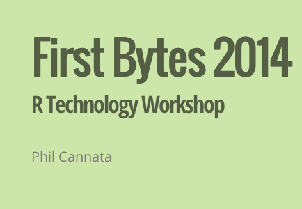
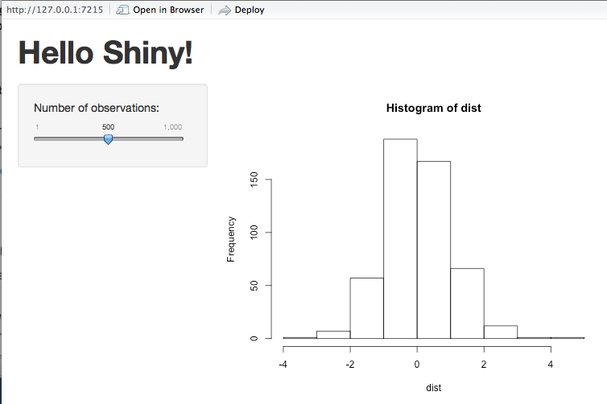
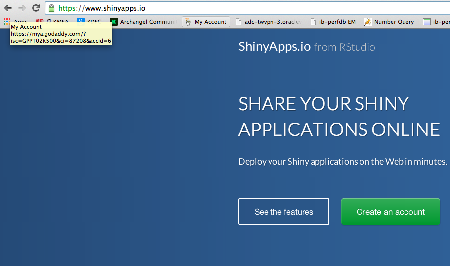

R Technology Workshop
===
**In 2011, the health care industry consumed 17.7% of US GDP, an average of 8,508 per person in the US.  This is the highest as both a dollar ammount and as a GDP percentage of any OECD county, and yet the United States ranks 26th out of 34 for life expectancy (at 78.7 years).  Health care decisions are arguably the most important decisions any of will make as consumers, and yet there is little to no market transparency on how much procedures cost, what our options are as consumers, and if we're receiving better care for higher prices.  We've chosen to work with a data set released by CMS, the government body in charge of Medicare, to help improve transparency for consumers and answer some very basic questions about the relationship between cost and quality in our health care system which would otherwise be impossible answer.**

###This is how my RStudio is configured:
```{r}
sessionInfo()
```

You also need to install LaTeX if you want to generate PDF files from KnitR.  

 http://latex-project.org/ftp.html

###Getting Started - Clone the RWorkshop GiT Repository:

**Phils-MacBook-Pro:Mine pcannata$ pwd**  
/Users/pcannata/Mine  
**To clone the repository, type into terminal/command line:  git clone https://github.com/alyshialedlie/RProject**  


###R Dataframes

**A data frame is used for storing data tables. It is a list of vectors of equal length. For example, the following variable df is a data frame containing three vectors n, s, b.**

```{r}
n = c(2, 3, 5) 
s = c("aa", "bb", "cc") 
b = c(TRUE, FALSE, TRUE) 
df = data.frame(n, s, b)       # df is a data frame
head(df)
``` 

Dataframes can be loaded from databases, CSVs, Excel, etc.. Loading dataframes from an Oracle database will be discussed later in this Workshop.

See also http://www.r-tutor.com/r-introduction/data-frame

Many R packages come with demo dataframes. The ggplot package comes with a demo dataframe called diamonds which we will use for this workshop.

```{r}
source("../02 R Dataframes/Dataframes.R", echo = TRUE)
```
For more on subsetting dataframes see http://www.ats.ucla.edu/stat/r/faq/subset_R.htm

###Connecting to Oracle with RJDBC
**RJDBC is an R package for makeing database connections in R.**

See also http://www.rforge.net/RJDBC/, and http://bommaritollc.com/2012/11/connecting-r-to-an-oracle-database-with-rjdbc/

```{r}
source("../02A RJDBC/ConnectToOracle.R", echo = TRUE)
```

###ggplot2
**ggplot is an R package for data exploration and visualization. It produces production quality graphics and allows you to slice and dice your data in many different ways. ggplot uses a general scheme for data visualization which breaks graphs up into semantic components such as scales and layers. In contrast to other graphics packages, ggplot2 allows the user to add, remove or alter components in a plot at a high level of abstraction.**

See also http://ggplot2.org/, http://cran.r-project.org/web/packages/ggplot2/ggplot2.pdf, and https://groups.google.com/forum/#!forum/ggplot2

```{r}
source("../03 ggplot/Plots.R", echo = TRUE)
```

**The Chapter 7 of "R for Everyone" has many more examples of ggplots.**

###ggplot2 and functions

```{r}
source("../03 ggplot/plotFunction.R", echo = TRUE)
```

**You should now be able to open RWorkshop/00 Doc/4diamonds.png. It should look like the following plot.**

 

###KnitR
**KnitR is an R package designed to generate dynamic reports using a mix of the R, LaTex, and the Rmarkdown (see http://rmarkdown.rstudio.com/?version=0.98.945&mode=desktop) languages.**  

See also http://yihui.name/knitr/ and http://kbroman.github.io/knitr_knutshell/

**Simple examples can be found in "04 KnitR/doc1.Rmd" and "04 KnitR/doc2.Rmd". These can generate html, pdf, and word documents. The output from Kniting doc2.Rmd is,**  

 

####A comprehensive KnitR example (which generated this document) can be found in "00 Doc/RWorkshop.Rmd".  

###slidify
**You can use Slidify to generate HTML slide decks using only the Rmarkdown language.**  

See also http://slidify.org and http://slidify.org/start.html

**Follow the instructions in "05 Slidify/slidify setup.R" to install and run slidify. You should be able to produce a slide deck with a first slide that looks something like the following.** 

  

**Cool trick - Any github repo with a branch called gh-pages will get served as a website. If the content of that repo is the stuff of websites (html,css), then you get free web hosting. So, create a branch called gh-pages and push to it.**  

###shiny
**The shiny R package allows you to build interactive web-based applications using only R with no knowledge of html, css, or javascript needed. You just need to write two scripts (see the example files in the 06Shiny directory):**  

* ui.R : Defines the layout and the interactive elements that the user can access.  
* server.R : Defines what computations are done in response to user interactions. 

See also http://shiny.rstudio.com and http://shiny.rstudio.com/tutorial 

To run the shiny app that's in the 06Shiny directory run the following in the main RWorkshop directory (make sure the working directory is set to this directory):  
library(shiny)  
runApp("06Shiny")   # Make sure there are no spaces in the string argument to runAPP

This should pop the application up in a browser, you can also access it in a browser at http://127.0.0.1:6837. It should look like the following.

 

###shinyapps

The example above ran the shiny app on your local machine, but to share with others, you have to send around the R files and the user needs to have R and know a little bit about it.

Instead, you can remotely host shiny apps and then just send people links. Get a free account at shinyapps.io/signup.html and give it a try.




**library("devtools", lib.loc="/Library/Frameworks/R.framework/Versions/3.0/Resources/library")  
install_github( repo = "shinyapps", username="rstudio" )  
shinyapps::setAccountInfo(name='pcannata', token='3ECF447A741004F6A8B7208C9ED778E1', secret='. . . ')**  

```{r}
library(shinyapps)
getwd()
# Uncomment the following line to deploy the app.
#deployApp("../06Shiny")
```

**Now you can try the app at https://pcannata.shinyapps.io/06Shiny/ **  

See also https://www.shinyapps.io/ and http://shiny.rstudio.com/articles/shinyapps.html 


